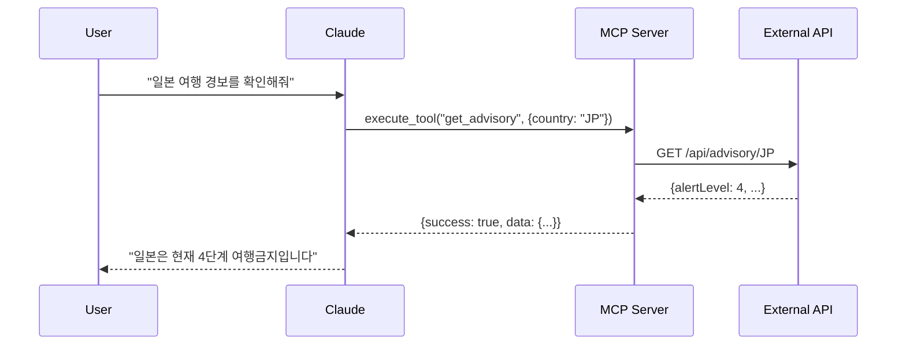

# Claude Desktop MCP (Model Context Protocol) 완벽 가이드

## 📖 목차

1. [MCP란 무엇인가?](#mcp란-무엇인가)
2. [Claude Desktop과 MCP의 관계](#claude-desktop과-mcp의-관계)
3. [설치 전 준비사항](#설치-전-준비사항)
4. [OS별 상세 설정 가이드](#os별-상세-설정-가이드)
5. [MCP 서버 유형별 설정](#mcp-서버-유형별-설정)
6. [실전 예제: 여행 경보 API 연동](#실전-예제-여행-경보-api-연동)
7. [문제 해결 가이드](#문제-해결-가이드)
8. [고급 기능 활용](#고급-기능-활용)
9. [자주 묻는 질문](#자주-묻는-질문)
10. [부록: 유용한 MCP 서버 목록](#부록-유용한-mcp-서버-목록)

---

## 🎯 MCP란 무엇인가?

### 개념 정의

**MCP (Model Context Protocol)**는 AI 모델이 외부 도구나 데이터 소스와 상호작용할 수 있게 해주는 표준 프로토콜입니다.

```
┌─────────────┐     MCP Protocol     ┌─────────────┐
│   Claude    │ ◄──────────────────► │  MCP Server │
│   Desktop   │                       │   (Tools)   │
└─────────────┘                       └─────────────┘
     ↕                                      ↕
┌─────────────┐                       ┌─────────────┐
│    User     │                       │  External   │
│  Interface  │                       │  Resources  │
└─────────────┘                       └─────────────┘
```

### 주요 특징

1. **표준화된 통신**: JSON-RPC 기반 프로토콜
2. **양방향 통신**: 요청-응답 패턴
3. **확장 가능**: 다양한 도구와 서비스 연동
4. **보안**: 로컬 실행으로 데이터 보호

### MCP가 제공하는 기능

- **도구 실행**: 파일 시스템 접근, 웹 검색, 데이터베이스 쿼리
- **리소스 접근**: 문서, API, 데이터셋 접근
- **컨텍스트 제공**: AI에게 추가 정보 제공
- **작업 자동화**: 반복 작업 자동 수행

---

## 🔗 Claude Desktop과 MCP의 관계

### 아키텍처 구조

```
Claude Desktop 앱
├── Claude AI 엔진
├── MCP 클라이언트
│   ├── 서버 관리자
│   ├── 프로토콜 핸들러
│   └── 메시지 라우터
└── UI 인터페이스
    ├── 채팅 창
    ├── MCP 서버 상태 표시
    └── 설정 관리
```

### 통신 방식

#### 1. stdio (표준 입출력) 방식
```json
{
  "transport": "stdio",
  "command": "node",
  "args": ["server.js"]
}
```

#### 2. HTTP 방식 (향후 지원 예정)
```json
{
  "transport": "http",
  "url": "http://localhost:3000"
}
```

### 메시지 흐름



---

## 🛠️ 설치 전 준비사항

### 시스템 요구사항

#### 최소 사양
- **OS**: macOS 11.0+, Windows 10+, Ubuntu 20.04+
- **RAM**: 4GB 이상
- **디스크**: 500MB 여유 공간
- **CPU**: 64비트 프로세서

#### 권장 사양
- **RAM**: 8GB 이상
- **디스크**: 2GB 여유 공간
- **네트워크**: 안정적인 인터넷 연결

### 필수 소프트웨어

#### 1. Node.js 설치 확인 및 설치

##### 설치 확인
```bash
# Node.js 버전 확인
node --version
# 출력 예: v20.11.0

# npm 버전 확인
npm --version
# 출력 예: 10.2.4
```

##### Node.js 설치 방법

**macOS (Homebrew 사용)**
```bash
# Homebrew 설치 (이미 설치되어 있으면 생략)
/bin/bash -c "$(curl -fsSL https://raw.githubusercontent.com/Homebrew/install/HEAD/install.sh)"

# Node.js 설치
brew install node

# 특정 버전 설치 (예: Node.js 20)
brew install node@20
```

**Windows (Chocolatey 사용)**
```powershell
# Chocolatey 설치 (관리자 권한 필요)
Set-ExecutionPolicy Bypass -Scope Process -Force
[System.Net.ServicePointManager]::SecurityProtocol = [System.Net.ServicePointManager]::SecurityProtocol -bor 3072
iex ((New-Object System.Net.WebClient).DownloadString('https://community.chocolatey.org/install.ps1'))

# Node.js 설치
choco install nodejs
```

**Linux (Ubuntu/Debian)**
```bash
# NodeSource 저장소 추가
curl -fsSL https://deb.nodesource.com/setup_20.x | sudo -E bash -

# Node.js 설치
sudo apt-get install -y nodejs
```

#### 2. Claude Desktop 앱 설치

**다운로드 링크**
- macOS: [Claude for Mac](https://claude.ai/download/mac)
- Windows: [Claude for Windows](https://claude.ai/download/windows)
- Linux: [Claude for Linux](https://claude.ai/download/linux)

**설치 확인**
```bash
# macOS
ls -la /Applications/Claude.app

# Windows (PowerShell)
Test-Path "$env:LOCALAPPDATA\Programs\Claude"

# Linux
which claude-desktop
```

### 환경 변수 설정

#### PATH 확인 및 설정

**macOS/Linux**
```bash
# .zshrc 또는 .bashrc에 추가
export PATH="/usr/local/bin:$PATH"
export NODE_PATH="/usr/local/lib/node_modules"

# 변경사항 적용
source ~/.zshrc  # 또는 source ~/.bashrc
```

**Windows**
```powershell
# 시스템 환경 변수에 Node.js 경로 추가
[Environment]::SetEnvironmentVariable("Path", $env:Path + ";C:\Program Files\nodejs", [EnvironmentVariableTarget]::Machine)
```

---

## 💻 OS별 상세 설정 가이드

### macOS 설정

#### 1. 설정 파일 위치 찾기

```bash
# Claude Desktop 설정 디렉토리
cd ~/Library/Application\ Support/Claude

# 디렉토리가 없으면 생성
mkdir -p ~/Library/Application\ Support/Claude

# 설정 파일 생성/편집
touch claude_desktop_config.json
nano claude_desktop_config.json
```

#### 2. 설정 파일 작성

**기본 구조**
```json
{
  "mcpServers": {
    "서버이름": {
      "command": "실행명령",
      "args": ["인자1", "인자2"],
      "env": {
        "환경변수": "값"
      }
    }
  }
}
```

**실제 예시**
```json
{
  "mcpServers": {
    "travel-advisory": {
      "command": "/usr/local/bin/node",
      "args": ["/Users/username/mcp/travel-advisory/dist/index.js"],
      "env": {
        "NODE_ENV": "production",
        "LOG_LEVEL": "info"
      }
    },
    "file-manager": {
      "command": "/usr/local/bin/node",
      "args": ["/Users/username/mcp/file-manager/index.js"],
      "env": {
        "ALLOWED_PATHS": "/Users/username/Documents"
      }
    }
  },
  "debugMode": true,
  "logLevel": "debug"
}
```

#### 3. 권한 설정

```bash
# 실행 권한 부여
chmod +x /Users/username/mcp/travel-advisory/dist/index.js

# 파일 소유권 확인
ls -la ~/Library/Application\ Support/Claude/claude_desktop_config.json

# 필요시 소유권 변경
chown $(whoami) ~/Library/Application\ Support/Claude/claude_desktop_config.json
```

#### 4. Claude Desktop 재시작

```bash
# Claude Desktop 완전 종료
pkill -f Claude

# 프로세스 확인
ps aux | grep Claude

# Claude Desktop 재시작
open -a Claude
```

### Windows 설정

#### 1. 설정 파일 위치

```powershell
# 설정 파일 경로
$configPath = "$env:APPDATA\Claude"

# 디렉토리 생성
New-Item -ItemType Directory -Force -Path $configPath

# 설정 파일 경로
$configFile = "$configPath\claude_desktop_config.json"

# 파일 생성/편집
if (!(Test-Path $configFile)) {
    New-Item -ItemType File -Path $configFile
}

# 메모장으로 편집
notepad $configFile
```

#### 2. Windows용 설정 예시

```json
{
  "mcpServers": {
    "travel-advisory": {
      "command": "C:\\Program Files\\nodejs\\node.exe",
      "args": ["C:\\Users\\username\\mcp\\travel-advisory\\dist\\index.js"],
      "env": {
        "NODE_ENV": "production",
        "TEMP": "C:\\Users\\username\\AppData\\Local\\Temp"
      },
      "cwd": "C:\\Users\\username\\mcp\\travel-advisory"
    },
    "powershell-tools": {
      "command": "powershell.exe",
      "args": ["-ExecutionPolicy", "Bypass", "-File", "C:\\Users\\username\\mcp\\tools.ps1"]
    }
  },
  "debugMode": true
}
```

#### 3. Windows Defender 예외 추가

```powershell
# Windows Defender 예외 추가 (관리자 권한 필요)
Add-MpPreference -ExclusionPath "$env:APPDATA\Claude"
Add-MpPreference -ExclusionProcess "Claude.exe"
Add-MpPreference -ExclusionProcess "node.exe"
```

#### 4. Claude Desktop 재시작

```powershell
# Claude Desktop 종료
Stop-Process -Name "Claude" -Force -ErrorAction SilentlyContinue

# 프로세스 확인
Get-Process | Where-Object {$_.Name -like "*Claude*"}

# Claude Desktop 시작
Start-Process "Claude"
```

### Linux 설정

#### 1. 설정 파일 위치

```bash
# 설정 디렉토리
CONFIG_DIR=~/.config/Claude

# 디렉토리 생성
mkdir -p $CONFIG_DIR

# 설정 파일 생성/편집
nano $CONFIG_DIR/claude_desktop_config.json
```

#### 2. Linux용 설정 예시

```json
{
  "mcpServers": {
    "travel-advisory": {
      "command": "/usr/bin/node",
      "args": ["/home/username/mcp/travel-advisory/dist/index.js"],
      "env": {
        "NODE_ENV": "production",
        "HOME": "/home/username"
      }
    },
    "system-tools": {
      "command": "/usr/bin/python3",
      "args": ["/home/username/mcp/system_tools.py"],
      "env": {
        "PYTHONPATH": "/home/username/mcp/lib"
      }
    }
  }
}
```

#### 3. 시스템 서비스 설정 (선택사항)

```bash
# systemd 서비스 파일 생성
sudo nano /etc/systemd/system/claude-mcp.service
```

```ini
[Unit]
Description=Claude MCP Server
After=network.target

[Service]
Type=simple
User=username
ExecStart=/usr/bin/node /home/username/mcp/server.js
Restart=always

[Install]
WantedBy=multi-user.target
```

```bash
# 서비스 활성화 및 시작
sudo systemctl enable claude-mcp
sudo systemctl start claude-mcp
```

---

## 🔧 MCP 서버 유형별 설정

### 1. 로컬 Node.js MCP 서버

#### 프로젝트 구조
```
my-mcp-server/
├── package.json
├── src/
│   └── index.ts
├── dist/
│   └── index.js
└── tsconfig.json
```

#### package.json
```json
{
  "name": "my-mcp-server",
  "version": "1.0.0",
  "type": "module",
  "main": "dist/index.js",
  "scripts": {
    "build": "tsc",
    "dev": "tsx src/index.ts"
  },
  "dependencies": {
    "@modelcontextprotocol/sdk": "^1.0.0"
  },
  "devDependencies": {
    "typescript": "^5.0.0",
    "tsx": "^4.0.0"
  }
}
```

#### Claude Desktop 설정
```json
{
  "mcpServers": {
    "my-server": {
      "command": "node",
      "args": ["./dist/index.js"],
      "cwd": "/path/to/my-mcp-server"
    }
  }
}
```

### 2. Python MCP 서버

#### 프로젝트 구조
```
python-mcp-server/
├── requirements.txt
├── server.py
└── venv/
```

#### requirements.txt
```
mcp-server-sdk>=1.0.0
```

#### Claude Desktop 설정
```json
{
  "mcpServers": {
    "python-server": {
      "command": "python3",
      "args": ["server.py"],
      "cwd": "/path/to/python-mcp-server",
      "env": {
        "PYTHONPATH": "./venv/lib/python3.11/site-packages"
      }
    }
  }
}
```

### 3. Docker 기반 MCP 서버

#### Dockerfile
```dockerfile
FROM node:20-alpine
WORKDIR /app
COPY package*.json ./
RUN npm ci
COPY . .
RUN npm run build
CMD ["node", "dist/index.js"]
```

#### docker-compose.yml
```yaml
version: '3.8'
services:
  mcp-server:
    build: .
    ports:
      - "3000:3000"
    environment:
      - NODE_ENV=production
    volumes:
      - ./data:/app/data
```

#### Claude Desktop 설정
```json
{
  "mcpServers": {
    "docker-server": {
      "command": "docker",
      "args": ["run", "-i", "my-mcp-server:latest"]
    }
  }
}
```

### 4. 원격 API 프록시 MCP 서버

#### proxy-server.js
```javascript
import { Server } from '@modelcontextprotocol/sdk';
import axios from 'axios';

const server = new Server({
  name: 'api-proxy',
  version: '1.0.0'
});

server.setRequestHandler('tools/execute', async (request) => {
  const { tool, args } = request.params;

  if (tool === 'fetch_api') {
    const response = await axios.get(args.url);
    return {
      content: [{
        type: 'text',
        text: JSON.stringify(response.data)
      }]
    };
  }
});

server.start();
```

#### Claude Desktop 설정
```json
{
  "mcpServers": {
    "api-proxy": {
      "command": "node",
      "args": ["proxy-server.js"],
      "env": {
        "API_BASE_URL": "https://api.example.com"
      }
    }
  }
}
```

---

## 🌏 실전 예제: 여행 경보 API 연동

### 프로젝트 설정

#### 1. 프로젝트 클론 및 빌드

```bash
# 프로젝트 클론
git clone https://github.com/thruthesky/mcp-test.git
cd mcp-test

# 의존성 설치
npm install

# TypeScript 빌드
npm run build

# 빌드 결과 확인
ls -la dist/
```

#### 2. 절대 경로 확인

```bash
# 현재 디렉토리의 절대 경로
pwd
# 출력 예: /Users/username/projects/mcp-test

# Node.js 경로 확인
which node
# 출력 예: /usr/local/bin/node

# 빌드된 파일 경로
realpath dist/index.js
# 출력 예: /Users/username/projects/mcp-test/dist/index.js
```

### Claude Desktop 설정

#### 1. 설정 파일 편집

```bash
# macOS
nano ~/Library/Application\ Support/Claude/claude_desktop_config.json
```

#### 2. 여행 경보 서버 추가

```json
{
  "mcpServers": {
    "travel-advisory-local": {
      "command": "/usr/local/bin/node",
      "args": ["/Users/username/projects/mcp-test/dist/index.js"],
      "env": {
        "NODE_ENV": "production",
        "LOG_LEVEL": "info"
      },
      "cwd": "/Users/username/projects/mcp-test",
      "timeout": 30000
    },
    "travel-advisory-remote": {
      "command": "npx",
      "args": [
        "@modelcontextprotocol/server-proxy",
        "https://mcp-test-production-5d0b.up.railway.app"
      ],
      "env": {
        "PROXY_MODE": "http"
      }
    }
  },
  "debugMode": true,
  "logLevel": "debug"
}
```

### 사용 방법

#### 1. Claude Desktop 재시작

```bash
# macOS
pkill -f Claude && sleep 2 && open -a Claude

# Windows (PowerShell)
Stop-Process -Name "Claude" -Force; Start-Sleep 2; Start-Process "Claude"
```

#### 2. MCP 서버 상태 확인

Claude Desktop에서:
1. 설정 아이콘 클릭
2. "Developer" 탭 선택
3. "MCP Servers" 확인
4. "travel-advisory-local" 상태가 "Connected" 확인

#### 3. 대화 예시

```
사용자: @travel-advisory-local 일본 여행 경보를 확인해줘

Claude: 일본 여행 경보를 확인하겠습니다.

[MCP 서버 호출: get_advisory("JP")]

일본 여행 경보 정보:
- 경보 단계: 4단계 (여행금지)
- 사유: 코로나25 대유행
- 요약: 일본 전 지역 여행금지 상태입니다. 즉시 귀국을 권고합니다.
- 업데이트: 2025-09-20

⚠️ 현재 일본은 여행이 금지된 상태입니다. 여행 계획을 연기하시기 바랍니다.
```

### 고급 사용법

#### 1. 여러 명령 조합

```
사용자: @travel-advisory-local을 사용해서 다음 작업을 수행해줘:
1. 모든 4단계 경보 국가 조회
2. 한국인의 미국 비자 정보 확인
3. 태국 긴급 연락처 조회

Claude: 요청하신 정보를 순차적으로 확인하겠습니다.

[MCP 호출 1: list_advisories(level=4)]
[MCP 호출 2: get_visa_info("US", "KR")]
[MCP 호출 3: get_emergency_contacts("TH")]

결과:
1. 4단계 경보 국가: 일본, 북한, 시리아
2. 한국인 미국 비자: ESTA 필요 (90일 무비자)
3. 태국 긴급연락처: 경찰 191, 의료 1669
```

#### 2. 자동화 스크립트

```javascript
// auto-check.js
const countries = ['JP', 'US', 'TH', 'VN', 'CN'];

async function checkAllCountries() {
  for (const country of countries) {
    console.log(`Checking ${country}...`);
    // MCP 서버 호출 로직
  }
}
```

---

## 🔍 문제 해결 가이드

### 일반적인 오류와 해결법

#### 1. "Could not attach to MCP server" 오류

**원인**: 서버 실행 파일을 찾을 수 없음

**해결법**:
```bash
# 1. 파일 존재 확인
ls -la /path/to/server.js

# 2. 실행 권한 확인
chmod +x /path/to/server.js

# 3. Node.js 경로 확인
which node

# 4. 절대 경로 사용
{
  "command": "/usr/local/bin/node",  # 절대 경로
  "args": ["/absolute/path/to/server.js"]  # 절대 경로
}
```

#### 2. "ENOENT: no such file or directory" 오류

**원인**: 작업 디렉토리 또는 파일 경로 문제

**해결법**:
```json
{
  "mcpServers": {
    "my-server": {
      "command": "node",
      "args": ["./dist/index.js"],
      "cwd": "/Users/username/projects/my-server"  // cwd 명시
    }
  }
}
```

#### 3. "Permission denied" 오류

**원인**: 파일 실행 권한 없음

**해결법**:
```bash
# macOS/Linux
chmod +x server.js
chmod -R 755 /path/to/mcp/directory

# Windows (관리자 권한)
icacls "C:\path\to\server.js" /grant Everyone:F
```

#### 4. "Module not found" 오류

**원인**: Node.js 모듈 누락

**해결법**:
```bash
# 프로젝트 디렉토리로 이동
cd /path/to/project

# node_modules 재설치
rm -rf node_modules package-lock.json
npm install

# 전역 모듈 설치 (필요한 경우)
npm install -g @modelcontextprotocol/sdk
```

### 디버깅 방법

#### 1. 로그 확인

**macOS**
```bash
# Claude Desktop 로그
tail -f ~/Library/Logs/Claude/*.log

# Console.app에서 확인
open /Applications/Utilities/Console.app
# "Claude" 검색
```

**Windows**
```powershell
# 로그 파일 위치
Get-ChildItem "$env:LOCALAPPDATA\Claude\logs"

# 실시간 로그 모니터링
Get-Content "$env:LOCALAPPDATA\Claude\logs\main.log" -Wait
```

**Linux**
```bash
# 시스템 로그 확인
journalctl -f | grep -i claude

# 애플리케이션 로그
tail -f ~/.config/Claude/logs/*.log
```

#### 2. 디버그 모드 활성화

```json
{
  "mcpServers": {
    // ... 서버 설정 ...
  },
  "debugMode": true,
  "logLevel": "debug",
  "verboseLogging": true
}
```

#### 3. 수동 테스트

```bash
# MCP 서버 직접 실행 테스트
node /path/to/server.js

# 환경 변수 포함 테스트
NODE_ENV=production node /path/to/server.js

# 디버그 모드로 실행
DEBUG=* node /path/to/server.js
```

### 성능 문제 해결

#### 1. 메모리 사용량 최적화

```json
{
  "mcpServers": {
    "my-server": {
      "command": "node",
      "args": ["--max-old-space-size=512", "server.js"],
      "env": {
        "NODE_OPTIONS": "--max-old-space-size=512"
      }
    }
  }
}
```

#### 2. 타임아웃 설정

```json
{
  "mcpServers": {
    "my-server": {
      "command": "node",
      "args": ["server.js"],
      "timeout": 60000,  // 60초
      "restartOnFailure": true,
      "maxRestarts": 3
    }
  }
}
```

---

## 🚀 고급 기능 활용

### 1. 다중 MCP 서버 구성

```json
{
  "mcpServers": {
    "file-system": {
      "command": "node",
      "args": ["fs-server.js"],
      "permissions": ["read", "write"]
    },
    "database": {
      "command": "node",
      "args": ["db-server.js"],
      "env": {
        "DB_CONNECTION": "postgresql://localhost/mydb"
      }
    },
    "web-search": {
      "command": "python3",
      "args": ["search_server.py"],
      "env": {
        "SEARCH_API_KEY": "${SEARCH_API_KEY}"  // 환경변수 참조
      }
    }
  }
}
```

### 2. 조건부 서버 활성화

```json
{
  "mcpServers": {
    "dev-server": {
      "command": "node",
      "args": ["dev-server.js"],
      "enabled": "${NODE_ENV}" === "development"  // 개발 환경에서만 활성화
    },
    "prod-server": {
      "command": "node",
      "args": ["prod-server.js"],
      "enabled": "${NODE_ENV}" === "production"
    }
  }
}
```

### 3. 보안 설정

```json
{
  "mcpServers": {
    "secure-server": {
      "command": "node",
      "args": ["server.js"],
      "sandbox": true,  // 샌드박스 모드
      "permissions": {
        "filesystem": {
          "read": ["/allowed/path/*"],
          "write": ["/tmp/*"]
        },
        "network": {
          "allowed_hosts": ["api.example.com"]
        }
      }
    }
  }
}
```

### 4. 자동 재시작 및 헬스체크

```json
{
  "mcpServers": {
    "monitored-server": {
      "command": "node",
      "args": ["server.js"],
      "healthCheck": {
        "enabled": true,
        "interval": 30000,  // 30초마다 체크
        "timeout": 5000,
        "retries": 3
      },
      "autoRestart": {
        "enabled": true,
        "delay": 5000,  // 5초 후 재시작
        "maxRestarts": 10
      }
    }
  }
}
```

### 5. 프록시 및 터널링

```json
{
  "mcpServers": {
    "proxied-server": {
      "command": "node",
      "args": ["server.js"],
      "proxy": {
        "http": "http://proxy.company.com:8080",
        "https": "http://proxy.company.com:8080",
        "no_proxy": "localhost,127.0.0.1"
      }
    }
  }
}
```

---

## ❓ 자주 묻는 질문

### Q1: MCP 서버가 연결되지 않아요

**A**: 다음 사항을 순서대로 확인하세요:

1. Node.js 설치 여부: `node --version`
2. 파일 경로 정확성: 절대 경로 사용
3. 실행 권한: `chmod +x` 명령 실행
4. Claude Desktop 재시작
5. 로그 파일 확인

### Q2: 여러 MCP 서버를 동시에 사용할 수 있나요?

**A**: 네, 가능합니다. `claude_desktop_config.json`에 여러 서버를 추가하세요:

```json
{
  "mcpServers": {
    "server1": { ... },
    "server2": { ... },
    "server3": { ... }
  }
}
```

### Q3: MCP 서버 업데이트는 어떻게 하나요?

**A**:
```bash
# 1. 프로젝트 디렉토리로 이동
cd /path/to/mcp-server

# 2. 최신 버전 받기
git pull

# 3. 의존성 업데이트
npm update

# 4. 재빌드
npm run build

# 5. Claude Desktop 재시작
```

### Q4: 환경 변수는 어떻게 설정하나요?

**A**: 설정 파일에서 `env` 필드 사용:

```json
{
  "mcpServers": {
    "my-server": {
      "command": "node",
      "args": ["server.js"],
      "env": {
        "API_KEY": "your-api-key",
        "NODE_ENV": "production",
        "HOME": "${HOME}"  // 시스템 환경변수 참조
      }
    }
  }
}
```

### Q5: MCP 서버 로그는 어디서 볼 수 있나요?

**A**:

- **macOS**: `~/Library/Logs/Claude/`
- **Windows**: `%LOCALAPPDATA%\Claude\logs\`
- **Linux**: `~/.config/Claude/logs/`

### Q6: Python MCP 서버는 어떻게 만드나요?

**A**: Python MCP SDK를 사용하세요:

```python
# server.py
from mcp_server import Server, Request, Response

server = Server("my-python-server", "1.0.0")

@server.tool("get_data")
async def get_data(request: Request) -> Response:
    return Response(content={"data": "Hello from Python!"})

if __name__ == "__main__":
    server.run()
```

### Q7: MCP 서버가 느려요

**A**: 성능 최적화 방법:

1. 캐싱 구현
2. 비동기 처리 사용
3. 메모리 제한 설정
4. 불필요한 로깅 제거
5. 데이터 압축 사용

### Q8: 보안이 걱정돼요

**A**: 보안 강화 방법:

1. 샌드박스 모드 사용
2. 파일시스템 접근 제한
3. 네트워크 호스트 화이트리스트
4. 환경 변수로 민감 정보 관리
5. HTTPS 사용 (원격 서버의 경우)

### Q9: Docker로 MCP 서버를 실행할 수 있나요?

**A**: 네, 가능합니다:

```json
{
  "mcpServers": {
    "docker-server": {
      "command": "docker",
      "args": [
        "run",
        "--rm",
        "-i",
        "--network=host",
        "my-mcp-image:latest"
      ]
    }
  }
}
```

### Q10: MCP 서버 개발 도구는 뭐가 있나요?

**A**:

- **SDK**: @modelcontextprotocol/sdk
- **디버거**: Chrome DevTools (Node.js)
- **테스트**: Jest, Mocha
- **모니터링**: PM2, Forever
- **로깅**: Winston, Bunyan

---

## 📚 부록: 유용한 MCP 서버 목록

### 공식 MCP 서버

1. **filesystem** - 파일 시스템 접근
   ```bash
   npm install @modelcontextprotocol/server-filesystem
   ```

2. **github** - GitHub API 통합
   ```bash
   npm install @modelcontextprotocol/server-github
   ```

3. **google-drive** - Google Drive 접근
   ```bash
   npm install @modelcontextprotocol/server-google-drive
   ```

### 커뮤니티 MCP 서버

1. **database-query** - 데이터베이스 쿼리
2. **web-scraper** - 웹 스크래핑
3. **api-gateway** - API 통합
4. **automation-tools** - 자동화 도구
5. **analytics** - 데이터 분석

### 예제 MCP 서버

1. **여행 경보 API**
   - GitHub: https://github.com/thruthesky/mcp-test
   - 기능: 여행 경보, 비자 정보, 긴급 연락처

2. **날씨 정보**
   ```json
   {
     "mcpServers": {
       "weather": {
         "command": "npx",
         "args": ["@mcp/weather-server"],
         "env": {
           "WEATHER_API_KEY": "your-key"
         }
       }
     }
   }
   ```

3. **번역 서비스**
   ```json
   {
     "mcpServers": {
       "translator": {
         "command": "node",
         "args": ["translator-server.js"],
         "env": {
           "DEEPL_API_KEY": "your-key"
         }
       }
     }
   }
   ```

---

## 🎓 학습 자료

### 공식 문서
- [MCP Protocol Specification](https://github.com/modelcontextprotocol/spec)
- [Claude Desktop Documentation](https://claude.ai/docs/desktop)
- [MCP SDK Documentation](https://github.com/modelcontextprotocol/sdk)

### 튜토리얼
- [첫 MCP 서버 만들기](https://example.com/mcp-tutorial)
- [MCP 서버 배포하기](https://example.com/mcp-deployment)
- [고급 MCP 패턴](https://example.com/mcp-patterns)

### 커뮤니티
- GitHub: https://github.com/modelcontextprotocol
- Discord: MCP Developers
- Reddit: r/ModelContextProtocol

---

## 📝 마무리

MCP는 Claude Desktop의 기능을 무한히 확장할 수 있는 강력한 도구입니다. 이 가이드를 통해:

1. ✅ MCP의 개념과 작동 원리를 이해했습니다
2. ✅ OS별 설정 방법을 마스터했습니다
3. ✅ 실제 MCP 서버를 연동하는 방법을 배웠습니다
4. ✅ 문제 해결 방법을 익혔습니다
5. ✅ 고급 기능을 활용할 수 있게 되었습니다

이제 여러분만의 MCP 서버를 만들어 Claude Desktop을 더욱 강력하게 활용해보세요!

---

**최종 업데이트**: 2025-09-20
**문서 버전**: 1.0.0
**작성자**: Claude Assistant with Human Collaboration

*이 문서에 대한 피드백이나 개선 사항은 GitHub Issues에서 제안해주세요.*